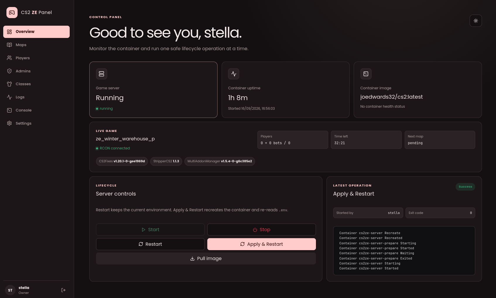
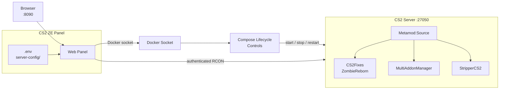

# CS2 Zombie Escape Web Panel



A self-hosted web panel and Docker stack for running a Counter-Strike 2 Zombie
Escape server.

This project began as a one-time Docker setup script. It is now a complete
management panel: install and update the server, monitor it in real time, edit
its configuration, manage maps and admins, moderate players, inspect logs, and
run RCON commands from a browser.

The included server is ready for Zombie Escape with:

- [Metamod:Source](https://www.sourcemm.net/)
- [CS2Fixes](https://github.com/Source2ZE/CS2Fixes) and ZombieReborn
- [MultiAddonManager](https://github.com/Source2ZE/MultiAddonManager)
- [StripperCS2](https://github.com/Source2ZE/StripperCS2)
- A starter map rotation, ZE gameplay settings, nominations, RTV, voting,
  weapons, knockback, flashlights, and player classes

## What the panel can do

- Start, stop, restart, recreate, and update the game-server container
- Show first-install download progress, container health, uptime, current map,
  player count, time remaining, next map, RCON state, and loaded plugins
- Edit `.env` through a validated settings UI, applying supported cvars live and
  clearly marking changes that require a restart
- Detect configuration drift and review pending changes before recreating the
  server
- Track Metamod and plugin versions, detect new upstream releases, and update
  them individually or automatically
- Add individual Workshop maps or import maps from a Workshop collection
- Edit the map rotation, groups, cooldowns, player limits, next map, and current
  map
- Manage CS2Fixes admins, permission flags, groups, and immunity
- Build Human and Zombie classes, including presets for the bundled GFL model
  pack
- View the live player roster and perform kick, ban, mute, gag, slay, infect,
  beacon, leader, revive, teleport, and other moderation actions
- Stream bounded container and game logs
- Run owner-only RCON commands with confirmation for disruptive commands
- Keep an audit trail and operation history in SQLite

## How it fits together



The Compose stack contains three services:

- `prepare-data` initializes persistent configuration and permissions.
- `cs2-server` runs SteamCMD, CS2, and the ZE plugin stack.
- `cs2-panel` serves the web application and manages the server through Docker
  and authenticated RCON.

## Requirements

- A Linux host with Docker Engine and Docker Compose v2
- A user allowed to access the Docker daemon
- At least 2 CPU cores and 2 GiB RAM
- At least 60 GB of free disk space, plus room for Workshop content
- TCP/UDP `27015` open for players when hosting publicly
- A [Steam Game Server Login Token](https://steamcommunity.com/dev/managegameservers)
  for app `730` when hosting publicly

The panel image is built locally by Compose. Node.js is only required for local
panel development, not for a normal deployment.

## Quick start

Clone the repository and create the local environment file:

```sh
git clone https://github.com/InterStella0/cs2ze-docker.git
cd cs2ze-docker
cp .env.example .env
```

Find the numeric group ID that owns the Docker socket:

```sh
stat -c '%g' /var/run/docker.sock
```

Open `.env` and make at least these changes:

```dotenv
DOCKER_GID=<group ID printed above>
CS2_RCONPW=<a strong unique password>
SRCDS_TOKEN=<your app 730 token for a public server>
```

You can also set `PANEL_ADMIN_USER` and `PANEL_ADMIN_PASSWORD` before the first
start. The bootstrap password must be at least 12 characters. If both values
remain blank, the panel creates an `admin` account with a random password.

Start the stack:

```sh
docker compose up -d --build
```

If the panel generated its own password, retrieve it immediately. It is printed
only when the owner account is first created:

```sh
docker compose logs cs2-panel
```

Open `http://<server-ip>:8090`, sign in, and replace the bootstrap password when
prompted. The initial CS2 download is large; its progress appears on the panel's
Overview page. You can also follow the raw startup output with:

```sh
docker compose logs -f cs2-server
```

The default server starts `ze_winter_warehouse_p` (Workshop item `3144617784`)
and mounts the GFL Zombie Escape Content pack (`3160448201`). One-player
infection is enabled so a fresh installation can be tested alone.

## Ports

| Port | Protocol | Purpose | Default exposure |
| --- | --- | --- | --- |
| `8090` | TCP | Web panel | All interfaces |
| `27015` | TCP/UDP | CS2 game server | All interfaces |
| `27020` | UDP | CSTV | All interfaces |
| `27050` | TCP | RCON | Host loopback only |

Change the published ports in `.env`. Set `PANEL_BIND_ADDR=127.0.0.1` if the
panel should only be reachable through a local connection or reverse proxy.

## Using the panel

### Overview

Overview displays server and RCON health, install progress, game state, loaded
plugins, and recent Compose jobs. The available lifecycle actions are:

- **Restart** restarts the existing container without rereading `.env`.
- **Apply & Restart** recreates the game-server container and applies pending
  environment changes.
- **Pull image** downloads the configured CS2 base image without restarting.

The panel remains online while the game server is stopped or recreated.

### Maps

The Maps page edits `server-config/cs2fixes/maplist.jsonc`. It can resolve Steam
Workshop metadata, import up to 100 items from a collection, configure map
groups and cooldowns, force the next map, or change maps immediately.

Saved catalog changes are copied into the live game tree. They can activate on
the next normal map change, or you can explicitly reload the list and current
map. Reloading interrupts active play and therefore requires confirmation.

### Players and admins

The Players page refreshes its roster through authenticated RCON. Before a
moderation command runs, the target is checked against the live roster again to
avoid acting on a stale player ID.

The Admins page manages `admins.jsonc`, including SteamID64 identities, direct
flags, inherited groups, and immunity. Admin changes can be reloaded live. If an
older installation still uses `CS2_ADMIN_STEAMID`, the page offers a one-time
migration into the managed admin file.

Panel accounts and in-game CS2Fixes admins are separate. The first panel account
is the owner; owner-only pages include Settings, Classes, and Console.

### Player classes

The Classes page manages the ZombieReborn `playerclass.jsonc` file used by
`!zclass`. You can edit class attributes and model pools or generate individual
or randomized classes from every model in the GFL content pack. Saved classes
load on the next map unless you explicitly reload the current map.

### Plugins

Plugins shows one card per component of the Metamod stack with four versions
that are easy to confuse:

- **Configured** is the version in `.env`, which is what the next boot installs.
- **On disk** comes from the installer's own state markers under
  `cs2-data/.cs2ze-mods/`, so it reflects what was actually downloaded.
- **Loaded** is what the running server reports through `meta list`.
- **Latest** is the newest release the panel has found upstream, from the GitHub
  releases of each Source2ZE plugin and the AlliedMods file index for Metamod.

Pick a release per plugin and save. The panel writes only the `*_VERSION` keys,
so the change shows up as a normal pending restart that you apply when it suits
you, or immediately with **Recreate the server after saving**.

Two guards apply before anything is written, because `install-mods.sh` aborts
the boot if a download fails or a version pairing is unsupported:

- A version is only offered if the panel has seen that release upstream with an
  archive whose name matches the URL the installer builds.
- The resulting version set is checked against the compatibility rules in
  [Version compatibility](#version-compatibility). Raising Metamod past build
  1411 while CS2Fixes stays on v1.20.1 is refused, with the same message the
  installer would print.

The update checker polls upstream on a schedule (12 hours by default) and
reports what is available. Automatic applying is opt-in, per plugin, and waits
for an empty server unless you say otherwise; an update it cannot apply safely
is reported on the page instead of forced through. A plugin pinned with a direct
`*_URL` archive is reported but never version-managed, since the installer
ignores its `*_VERSION` key.

### Settings, logs, and console

Settings updates the existing `.env` without discarding its comments. Values
that map to supported cvars are sent over RCON immediately; container-level
changes are collected in a pending-restart banner.

Logs switches between the current container stream and the newest CS2 game log.
Console provides an owner-only RCON terminal with indexed command suggestions,
serialized execution, bounded output, and confirmation for disruptive commands.

## Configuration and persistence

The repository separates shipped defaults from live server state:

| Path | Purpose | Source controlled |
| --- | --- | --- |
| `config/` | Default structured configuration | Yes |
| `.env` | Live environment and secrets | No |
| `server-config/` | Panel-managed CS2Fixes and Stripper configuration | No |
| `cs2-data/` | CS2 installation, Workshop downloads, and game logs | No |
| `panel-data/` | Panel database, sessions, audit/jobs, and backups | No |

On first start, `prepare-data` copies missing defaults from `config/` into
`server-config/`. Existing live files are never replaced by a Git update. The
installer then copies the managed runtime configuration into the game tree each
time the server starts.

Panel writes are validated and made atomically. Previous versions are stored
under `panel-data/backups/`. The panel also reports when the managed source and
the live copy in the CS2 installation differ.

Important managed files include:

- `server-config/cs2fixes/maplist.jsonc`
- `server-config/cs2fixes/admins.jsonc`
- `server-config/cs2fixes/cvar_whitelist.jsonc`
- `server-config/cs2fixes/zr/playerclass.jsonc`
- `server-config/cs2fixes/zr/weapons.cfg`
- `server-config/cs2fixes/zr/hitgroups.cfg`
- `server-config/cs2fixes/maps/`
- `server-config/stripper/`

To intentionally adopt a changed repository default, copy only that file from
`config/` to the corresponding location in `server-config/`, then use **Apply &
Restart**.

All persistent paths are host bind mounts. This project declares no Docker named
volumes, so `docker compose down -v` does not remove them. Do not delete
`cs2-data/`, `server-config/`, or `panel-data/` unless you intend to remove that
state.

## Useful environment settings

Most settings are documented and editable in the panel. A few deployment and
bootstrapping values are worth knowing before first start:

- `PANEL_BIND_ADDR` and `PANEL_PUBLISHED_PORT` control panel exposure.
- `DOCKER_GID` must match the group ID of `/var/run/docker.sock` on the host.
- `CS2_RCONPW` is required for the panel's live status and management features.
- `CS2_HOST_WORKSHOP_MAP` selects the starting Workshop map.
- `CS2_HOST_WORKSHOP_COLLECTION` must remain non-empty so CS2Fixes can intercept
  the startup command and substitute the managed map list.
- `MAM_EXTRA_ADDONS` contains server/client content packs, not playable maps.
- `CS2_ADDITIONAL_ARGS` defaults to
  `-disable_workshop_command_filtering`, which CS2Fixes needs for the startup
  collection hook.
- `MODS_FORCE_REINSTALL=1` downloads all enabled mod archives again on the next
  start. Return it to `0` afterward.

If a value consumed by the `joedwards32/cs2` image contains `/`, it may need to
be written as `\/` for that image's replacement logic. The panel validates the
known affected settings.

## Updating

Back up `.env`, `server-config/`, and `panel-data/` before a significant update.
Then update the checkout and rebuild the panel:

```sh
git pull --ff-only
docker compose up -d --build
```

Metamod and its plugins are updated from the panel's Plugins page rather than by
editing `.env` by hand; see [Plugins](#plugins). The versions live in `.env`, so
they survive a `git pull`.

The server update check runs through SteamCMD when its container starts. To pull
a newer configured base image, use **Pull image** followed by **Apply & Restart**,
or run:

```sh
docker compose pull cs2-server
docker compose up -d --build
```

When deploying with `rsync`, keep live state out of the source sync:

```sh
rsync -a --delete \
  --exclude 'cs2-data/' --exclude 'panel-data/' \
  --exclude 'server-config/' --exclude '.env' \
  --exclude '.git/' --exclude 'node_modules/' --exclude 'dist/' \
  ./ user@host:/path/to/cs2ze-docker/
```

## Version compatibility

The plugin versions in `.env.example` are pinned as a compatible set. As of
2026-09-24, upstream has split into two lanes that do not share a Metamod build:

- CS2Fixes v1.20.1 requires Metamod 2.0 build 1411 or earlier.
- MultiAddonManager v1.6 and later require a build newer than 1459.
- StripperCS2 v2.0 and later require build 1461 or later.

Because CS2Fixes pins the ceiling at build 1411, the whole stack stays on the
pre-KHook lane. The defaults therefore use Metamod build 1411, CS2Fixes v1.20.1,
MultiAddonManager v1.5.4, and StripperCS2 v1.1.4. StripperCS2 v1.1.4 is the
backport that carries the 2026-09-22 lump data offset without moving off build
1411. Upgrade these components as a tested set rather than changing one version
independently. The Plugins page enforces exactly these rules before it writes a
version, so a combination that cannot boot is refused there rather than at the
next container start.

Only switch `CS2FIXES_RUNTIME`, `MULTIADDONMANAGER_RUNTIME`, and
`STRIPPERCS2_RUNTIME` from `steamrt3` to `steamrt4` when the base CS2 image uses
a compatible Steam Runtime. These projects have also renamed their release
assets over time, so the installer tries each known name for a version in turn
and picks the archive format from the file extension; StripperCS2 v1.1.3 and
earlier ship a single runtime-less `.zip`, while v1.1.4 and later ship a
per-runtime `.tar.gz`.

## Security notes

The panel can control Docker and the game server. Treat panel access as
administrative access to the host.

- Do not expose port `8090` to the public Internet without TLS and appropriate
  network controls. Prefer a trusted reverse proxy or VPN.
- When TLS terminates at a reverse proxy, set `PANEL_COOKIE_SECURE=1` and set
  `PANEL_TRUST_PROXY=1` only when the proxy path is trusted.
- Keep RCON bound to loopback; the panel reaches it over the internal Compose
  network.
- Use unique, strong panel and RCON passwords. Remove bootstrap credentials from
  `.env` after the first successful login.
- Back up `panel-data/` securely because it contains authentication and audit
  data.

## Troubleshooting

### The panel says it cannot reach Docker

Verify the Docker socket's group ID and update `DOCKER_GID`:

```sh
stat -c '%g' /var/run/docker.sock
docker compose up -d --force-recreate cs2-panel
```

### The panel reports that the project directory is not mounted

The panel must see the checkout at the same absolute path used by the host
Docker daemon. Normally Compose discovers this automatically. If needed, set
`CS2ZE_PROJECT_DIR` in `.env` to the checkout's absolute host path and recreate
the panel.

### RCON is unavailable

Confirm that `CS2_RCONPW` is non-empty, the game server has finished starting,
and the panel and server were recreated after changing RCON settings:

```sh
docker compose up -d --force-recreate cs2-server cs2-panel
```

### A plugin or map configuration is not loading

Check the panel's drift warning, then inspect the game-server output:

```sh
docker compose logs --tail=300 cs2-server
```

From the server console, `meta version` and `meta list` show the active Metamod
installation and loaded plugins:

```sh
docker attach cs2ze-server
```

Detach without stopping the container with `Ctrl-p`, `Ctrl-q`.

## Development

The panel is a TypeScript workspace with a Fastify API, React/Vite frontend, and
shared validation package. Node.js 22 or newer is required.

```sh
cd panel
npm ci
npm run typecheck
npm test
```

Run the API and web development servers in separate terminals with
`npm run dev:server` and `npm run dev:web`.

## License

MIT
